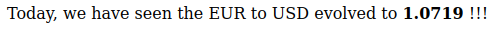

# statstrap

A frontend utility for easy Statit access

## Usage

Place `statstrap.js` in your HTML document's body 

```html
<script src="https://raw.githubusercontent.com/keyboardcat1/statstrap/main/src/statstrap.py"></script>
```

Use the `statit` tag attribute in any of your text elements for direct Statit access!

```html
<b statit="getObs:id=xr/daily/eur/usd" ></b>
```

#### Result




### Basic syntax

Your `statit` attribute should be of the following form:

```
<api_method>:[key1=value1],[key2=value2] ...
```

For the full list of the Statit function methods, see the [API Documentation]()