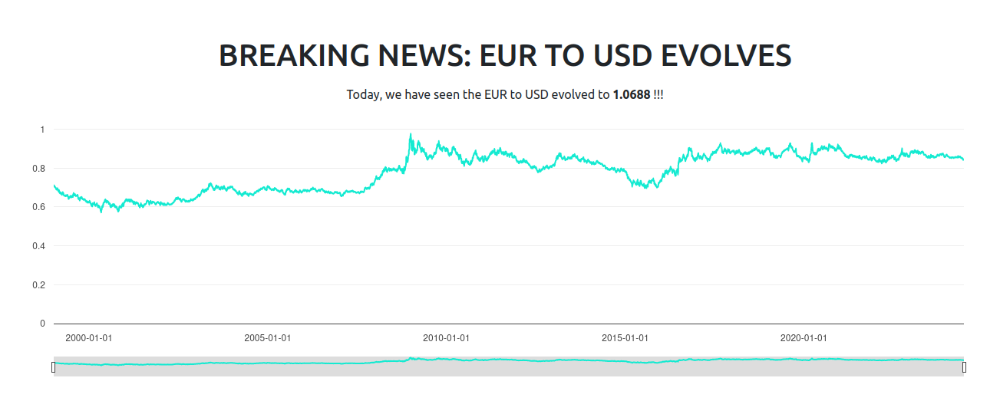

# Statstrap

A frontend utility for easy Statit access

## Usage

Place Statstrap's CSS and JS tags in your HTML document's head and body respectively

```html
<!-- head  -->
<link href="https://raw.githubusercontent.com/keyboardcat1/statstrap/main/src/statstrap.css" rel="stylesheet" />
<!-- body  -->
<script src="https://raw.githubusercontent.com/keyboardcat1/statstrap/main/src/statstrap.py"></script>
```

Use the `statit` tag attribute in any of your text elements for direct Statit access

```html
<b statit="getValue:id=xr/daily/eur/usd" ></b>
```

Or integrate Statit's metric charts using the iFrame endpoint!

```html
<iframe class="statit-metric" src="https://gostatit.com/f/xr/daily/eur/gbp"></iframe>
```

#### Result




### Basic syntax

Statit's iFrame endpoints are located at `https://gostatit.com/f/<serie_id>`. 

Your `statit` attribute should be of the following form:

```
<api_method>:[key1=value1],[key2=value2] ...
```

For the full list of the Statit API methods, see the [API Documentation]().